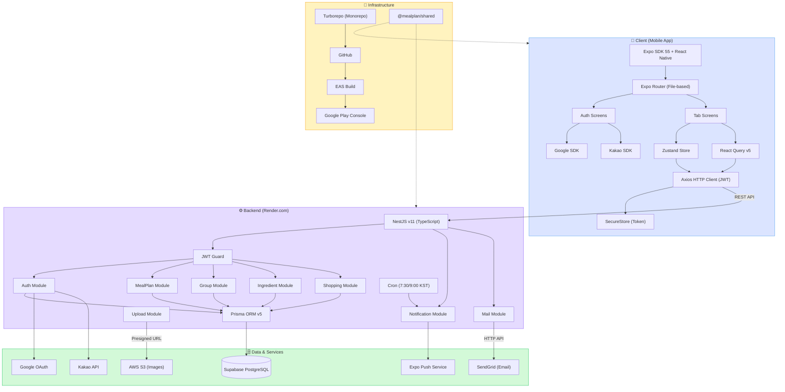

# 🥗 MealPlan

개인/가족 식단을 미리 계획하고 공유하는 모바일 앱

---

## 🏗 시스템 아키텍처



---

## ✨ 주요 기능

### 🍽 식단 관리
- 아침/점심/저녁/간식 식단 등록 및 관리 (식사 유형 수정 가능)
- 월간 캘린더 뷰 + 리스트 뷰 전환 (선택 상태 기억)
- 리스트 뷰: 전체 식단 날짜순 가상 스크롤 + 검색 + 기간 필터 + 사용자 필터
- 주간 홈 뷰 + 좌우 스와이프 주간 이동 (드래그 애니메이션) + 화살표 버튼
- 식단 복사 (다른 날짜에 동일 식단 등록)
- 여러 날짜에 동일 식단 일괄 등록
- 식단 템플릿 저장 및 불러오기 (iOS/Android 모두 지원)
- 식단 사진 첨부 (S3 업로드, 자동 리사이즈 1080px + JPEG 압축)
- 칼로리 수기 입력 + 일간/주간 요약
- 식단 통계 (TOP 5 메뉴 + 칼로리 요약, 홈 화면 토글)
- 전체 그룹 통계 합산 지원
- 레시피 URL → "레시피 보기" 버튼 (외부 브라우저)
- 스와이프 삭제

### 🥕 냉장고 (재료 관리)
- 재료 추가/수정/삭제/소진 처리
- 카테고리별 필터 (육류, 채소, 유제품 등)
- 유통기한 관리 (달력 선택 + 직접 입력)
- 유통기한 임박 경고 (3일 이내) + 매일 9:00 KST 푸시 알림
- 전체 선택 + 일괄 삭제 / 스와이프 삭제

### 🛒 쇼핑 리스트
- 항목 추가/체크/삭제 + 수량/단위 입력
- 완료 섹션 분리 (체크 해제로 복귀)
- 전체 선택 + 일괄 삭제
- 이번 주 식단 기반 자동 생성
- 카카오톡/문자 등으로 공유

### 👥 그룹
- 그룹 생성 + 6자리 초대 코드 + 그룹 색상 선택 (10색 팔레트)
- 그룹 이름/색상 수정 (관리자 전용)
- 초대 코드 복사/공유 (모든 멤버 가능) + 딥링크
- 멤버 관리 (역할 변경, 강퇴) + 프로필 사진 표시
- 역할: 관리자 / 편집자 / 뷰어
- 그룹별 식단 필터 (드롭다운) + 전체 그룹 보기
- 기본 그룹 설정 (앱 시작 시 자동 선택)
- 캘린더 dot / 식단 카드에 그룹 색상 바 표시 (전체 그룹 뷰)

### 🔐 인증
- 이메일/비밀번호 회원가입 + 이메일 인증 (SendGrid)
- 소셜 로그인 (Google, 카카오, Apple)
- 비밀번호 변경 / 비밀번호 찾기 (iOS/Android 모두 지원)
- 회원 탈퇴 (Soft Delete, 90일 이내 복구 가능)
- Play Store 앱 서명 키 기반 SHA-1 등록 (Google/카카오 로그인)

### ⚙️ 설정
- 프로필 수정 (이름 변경 커스텀 모달 + 사진 변경)
- 알림 ON/OFF 토글 (SecureStore 영속화)
- 기본 그룹 설정 (별 아이콘)
- 앱 소개 다시 보기 (온보딩 리셋, 1회 시청 후 숨김)

### 🔔 알림 (Cron)
- 매일 7:30 KST: 오늘 식단 알림
- 매일 9:00 KST: 유통기한 임박 알림

---

## 🛠 기술 스택

| 영역 | 기술 |
|------|------|
| **Mobile** | Expo SDK 55, React Native, Expo Router |
| **Backend** | NestJS v11 (TypeScript) |
| **Database** | PostgreSQL (Supabase) |
| **ORM** | Prisma v5 |
| **상태관리** | Zustand + TanStack Query v5 |
| **모노레포** | Turborepo + npm workspaces |
| **이미지 저장소** | AWS S3 (Presigned URL) |
| **이메일** | SendGrid (우선) / Resend / Gmail SMTP (폴백) |
| **빌드** | Expo EAS Build |
| **배포** | Render.com (백엔드), Google Play Console (Android) |

---

## 📁 프로젝트 구조

```
MealPlanning/
├── apps/
│   └── mobile/              # Expo React Native 앱
│       ├── app/             # Expo Router (파일 기반 라우팅)
│       │   ├── (auth)/      # 인증 화면 (sign-in, sign-up, verify-email, reactivate)
│       │   ├── (tabs)/      # 메인 탭 (home, calendar, fridge, shopping, settings)
│       │   └── onboarding.tsx
│       ├── src/
│       │   ├── components/  # 공통/도메인별 컴포넌트
│       │   ├── hooks/       # React Query 훅, 커스텀 훅
│       │   ├── services/    # API 서비스 레이어
│       │   ├── stores/      # Zustand 스토어 (auth, group, view-mode)
│       │   ├── utils/       # 유틸리티
│       │   └── constants/   # 색상, 스토리지 키 등
│       └── assets/          # 앱 아이콘, 스플래시, 로고
├── packages/
│   ├── api/                 # NestJS 백엔드
│   │   ├── src/modules/     # auth, meal-plans, groups, ingredients, shopping, notifications, mail, upload
│   │   └── prisma/          # 스키마 + 마이그레이션
│   └── shared/              # 공유 타입/상수 (모바일 + API 공통)
├── docs/                    # 문서 및 스크린샷
│   └── account-deletion.html  # Google Play 계정 삭제 안내 페이지
└── .github/
    └── workflows/
        └── keep-alive.yml   # Render.com 슬립 방지 핑 (4분마다)
```

---

## 📡 API 엔드포인트

### Auth (`/v1/auth`)
| Method | Path | 설명 | 인증 |
|--------|------|------|------|
| POST | /signup | 회원가입 | - |
| POST | /login | 로그인 | - |
| POST | /logout | 로그아웃 | JWT |
| POST | /refresh | 토큰 갱신 | - |
| GET | /me | 프로필 조회 | JWT |
| PATCH | /profile | 프로필 수정 | JWT |
| PATCH | /push-token | 푸시 토큰 등록 | JWT |
| POST | /change-password | 비밀번호 변경 | JWT |
| POST | /forgot-password | 비밀번호 재설정 링크 | - |
| POST | /reset-password | 비밀번호 재설정 | - |
| POST | /social/:provider | 소셜 로그인 (google/kakao/apple) | - |
| POST | /reactivate | 탈퇴 계정 복구 | - |
| GET | /verify-email | 이메일 인증 | - |
| DELETE | /account | 회원 탈퇴 | JWT |

### Meal Plans (`/v1/meal-plans`)
| Method | Path | 설명 | 인증 |
|--------|------|------|------|
| GET | / | 기간별 조회 | JWT |
| GET | /stats | 통계 (groupId 없으면 전체 합산) | JWT |
| GET | /search | 메뉴명 검색 | JWT |
| GET | /:id | 단건 조회 | JWT |
| POST | / | 생성 (배치 지원) | JWT |
| PUT | /:id | 수정 | JWT |
| DELETE | /:id | 삭제 | JWT |

### Groups (`/v1/groups`)
| Method | Path | 설명 | 인증 |
|--------|------|------|------|
| GET | /my | 내 그룹 목록 | JWT |
| POST | / | 그룹 생성 | JWT |
| POST | /join | 초대 코드 참여 | JWT |
| PATCH | /:id | 그룹 이름/색상 수정 | JWT |
| GET | /:id/members | 멤버 목록 | JWT |
| PATCH | /:id/members/:userId/role | 역할 변경 | JWT |
| DELETE | /:id/members/:userId | 멤버 내보내기 | JWT |
| DELETE | /:id/leave | 그룹 탈퇴 | JWT |

### Ingredients (`/v1/ingredients`)
| Method | Path | 설명 | 인증 |
|--------|------|------|------|
| GET | / | 목록 | JWT |
| GET | /expiring | 유통기한 임박 목록 | JWT |
| POST | / | 추가 | JWT |
| PUT | /:id | 수정 | JWT |
| DELETE | /:id | 삭제 | JWT |
| PATCH | /:id/consume | 소진 처리 | JWT |

### Upload (`/v1/upload`)
| Method | Path | 설명 | 인증 |
|--------|------|------|------|
| POST | /presigned-url | S3 업로드용 Presigned URL 발급 | JWT |

### Shopping (`/v1/shopping`)
| Method | Path | 설명 | 인증 |
|--------|------|------|------|
| GET | / | 목록 | JWT |
| POST | / | 추가 | JWT |
| POST | /generate | 식단 기반 자동 생성 | JWT |
| PATCH | /:id/toggle | 체크 토글 | JWT |
| DELETE | /:id | 삭제 | JWT |
| DELETE | /clear-checked | 완료 항목 일괄 삭제 | JWT |

---

## 🚀 개발 서버 실행

```bash
# API 서버 (로컬)
cd packages/api && npm run dev

# 모바일 앱 (네이티브 빌드 필요)
cd apps/mobile && npx expo start
```

> ⚠️ Expo Go는 네이티브 모듈(카카오/구글 SDK) 때문에 호환되지 않습니다. EAS 개발 빌드 또는 실제 APK 사용 필요.

---

## 🏗 배포

### 백엔드 (Render.com)

| 항목 | 값 |
|------|-----|
| URL | `https://mealplan-api-dtx0.onrender.com` |
| Build Command | `npm install --include=dev && npm run build -w packages/shared && cd packages/api && npx prisma migrate deploy && cd ../.. && npm run build -w packages/api` |
| Start Command | `node packages/api/dist/main.js` |

> Render 무료 플랜 슬립 방지: `.github/workflows/keep-alive.yml`로 4분마다 핑 전송 중

### 모바일 (EAS Build)

```bash
cd apps/mobile

# Android (AAB)
eas build --platform android --profile production

# iOS
eas build --platform ios --profile production
```

### Google Play
- 내부 테스트 트랙 배포 완료
- 계정 삭제 안내 페이지: `https://milcho0604.github.io/MealPlanning/account-deletion.html`

---

## 🔑 소셜 로그인 설정 (운영)

| 제공자 | 비고 |
|--------|------|
| Google | Play 앱 서명 키 SHA-1 등록 필요 (업로드 키 ≠ 서명 키) |
| 카카오 | Play 앱 서명 키 기반 키 해시 등록 필요 |
| Apple | `usesAppleSignIn: true` (app.json) |

> Play Console → 출시 → 앱 무결성 → "앱 서명 키 인증서"의 SHA-1을 각 제공자 콘솔에 등록

---

## 📄 라이선스

All Rights Reserved. Copyright (c) 2026 milcho0604

이 소프트웨어의 소스 코드 및 관련 자료에 대한 모든 권리는 저작권자에게 있습니다.
저작권자의 사전 서면 동의 없이 본 소프트웨어의 전부 또는 일부를
복제, 수정, 배포, 게시, 전송하거나 상업적 목적으로 이용할 수 없습니다.

---

## 👤 개발자

**milcho0604**
- GitHub: [@milcho0604](https://github.com/milcho0604)
- Email: milcho0604@gmail.com
