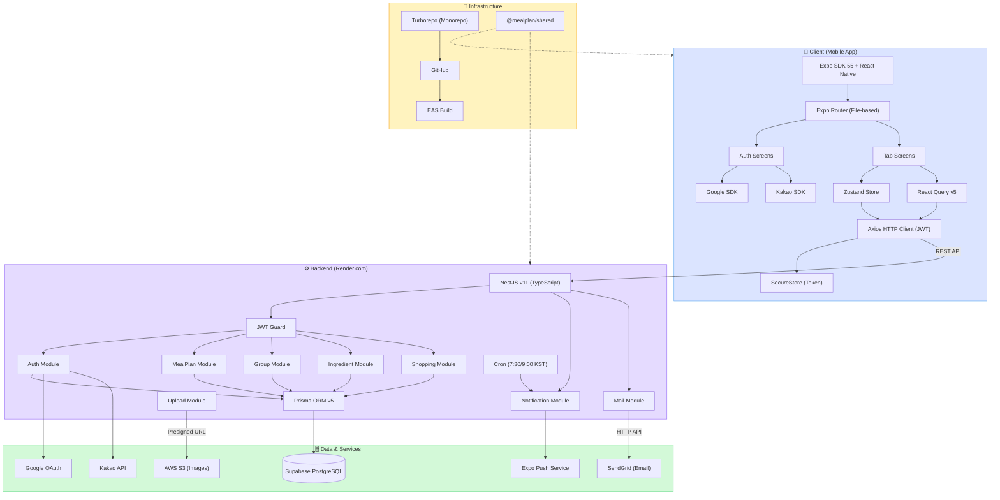

# 🥗 MealPlan

개인/가족 식단을 미리 계획하고 공유하는 모바일 앱

## 📱 스크린샷

> 추후 추가 예정

---

## 🏗 시스템 아키텍처



---

## ✨ 주요 기능

### 🍽 식단 관리
- 아침/점심/저녁/간식 식단 등록 및 관리 (식사 유형 수정 가능)
- 월간 캘린더 뷰 + 리스트 뷰 전환
- 리스트 뷰: 전체 식단 날짜순 가상 스크롤 + 검색 + 기간 필터 + 사용자 필터
- 주간 홈 뷰 + 메뉴명 검색
- 여러 날짜에 동일 식단 일괄 등록
- 식단 템플릿 저장 및 불러오기
- 식단 사진 첨부 (S3 업로드, 자동 리사이즈 1080px + JPEG 압축)
- 식단 추가/수정 시 날짜 표시 + 캘린더로 날짜 변경
- 자주 먹는 메뉴 TOP 5 통계

### 🥕 냉장고 (재료 관리)
- 재료 추가/수정/삭제/소진 처리
- 카테고리별 필터 (육류, 채소, 유제품 등)
- 유통기한 관리 (달력 선택 + 직접 입력)
- 유통기한 임박 경고 (3일 이내)

### 🛒 쇼핑 리스트
- 항목 추가/체크/삭제
- 완료 섹션 분리 (체크 해제로 복귀)
- 이번 주 식단 기반 자동 생성
- 카카오톡/문자 등으로 공유

### 👥 그룹
- 그룹 생성 + 6자리 초대 코드 + 그룹 색상 선택 (10색 팔레트)
- 초대 코드 공유 (모든 멤버 가능)
- 멤버 관리 (역할 변경, 강퇴)
- 역할: 관리자 / 편집자 / 뷰어
- 그룹별 식단 필터 (드롭다운) + 전체 그룹 보기
- 기본 그룹 설정 (앱 시작 시 자동 선택)
- 캘린더/식단 카드에 그룹 색상 표시

### 🔐 인증
- 이메일/비밀번호 회원가입 + 이메일 인증
- 소셜 로그인 (Google, 카카오, Apple)
- 비밀번호 변경 / 비밀번호 찾기
- 회원 탈퇴 (90일 이내 복구 가능)

### ⚙️ 설정
- 프로필 수정 (이름 변경)
- 알림 ON/OFF 토글 (설정 영속화)
- 테마 설정 (라이트/다크/시스템, 설정 영속화)
- 기본 그룹 설정

---

## 🛠 기술 스택

| 영역 | 기술 |
|------|------|
| **Mobile** | Expo SDK 55, React Native, Expo Router |
| **Backend** | NestJS v11 (TypeScript) |
| **Database** | PostgreSQL (Supabase) |
| **ORM** | Prisma v5 |
| **상태관리** | Zustand + TanStack Query v5 |
| **모노레포** | Turborepo + npm workspaces |
| **이미지 저장소** | AWS S3 (Presigned URL) |
| **이메일** | SendGrid (우선) / Resend / Gmail SMTP (폴백) |
| **빌드** | Expo EAS Build |
| **배포** | Render.com (백엔드) |

---

## 📁 프로젝트 구조

```
MealPlanning/
├── apps/
│   └── mobile/              # Expo React Native 앱
│       ├── app/             # Expo Router (파일 기반 라우팅)
│       │   ├── (auth)/      # 인증 화면
│       │   └── (tabs)/      # 메인 탭 화면
│       └── src/
│           ├── components/  # UI 컴포넌트
│           ├── hooks/       # React Query 훅
│           ├── services/    # API 서비스
│           ├── stores/      # Zustand 스토어 (auth, group, view-mode)
│           └── constants/   # 색상, 키 상수
├── packages/
│   ├── api/                 # NestJS 백엔드
│   │   ├── src/modules/     # auth, meal-plans, groups, ingredients, shopping, notifications, mail, upload
│   │   └── prisma/          # 스키마 + 마이그레이션
│   └── shared/              # 공유 타입/상수
└── .github/workflows/       # CI/CD
```

---

## 🚀 시작하기

### 사전 요구사항
- Node.js >= 20
- npm
- Expo CLI
- PostgreSQL (Supabase)

### 설치

```bash
# 레포 클론
git clone https://github.com/milcho0604/MealPlanning.git
cd MealPlanning

# 의존성 설치
npm install

# 공유 패키지 빌드
npm run build -w packages/shared
```

### 환경변수 설정

**루트 `.env`** (API 서버)
```env
DATABASE_URL=postgresql://...
DIRECT_URL=postgresql://...
JWT_SECRET=your-secret
JWT_EXPIRES_IN=1h
JWT_REFRESH_EXPIRES_IN=30d
API_PORT=3300
GOOGLE_CLIENT_ID=your-google-client-id
SENDGRID_API_KEY=your-sendgrid-key
MAIL_USER=your-email@gmail.com
APP_URL=https://your-api-url.com
AWS_ACCESS_KEY_ID=your-aws-key
AWS_SECRET_ACCESS_KEY=your-aws-secret
AWS_REGION=ap-northeast-2
AWS_S3_BUCKET=your-bucket-name
```

**`apps/mobile/.env`** (모바일 앱)
```env
EXPO_PUBLIC_API_URL=https://your-api-url.com
EXPO_PUBLIC_GOOGLE_WEB_CLIENT_ID=your-google-web-client-id
```

### 실행

```bash
# API 서버
cd packages/api && npm run dev

# 모바일 앱
cd apps/mobile && npx expo start

# 웹 브라우저 테스트
cd apps/mobile && npx expo start --web
```

---

## 📡 API 엔드포인트

### Auth (`/v1/auth`)
| Method | Path | 설명 |
|--------|------|------|
| POST | /signup | 회원가입 |
| POST | /login | 로그인 |
| POST | /refresh | 토큰 갱신 |
| GET | /me | 프로필 조회 |
| PATCH | /profile | 프로필 수정 |
| POST | /change-password | 비밀번호 변경 |
| POST | /forgot-password | 비밀번호 재설정 링크 |
| POST | /social/:provider | 소셜 로그인 |

### Meal Plans (`/v1/meal-plans`)
| Method | Path | 설명 |
|--------|------|------|
| GET | / | 기간별 조회 |
| GET | /stats | 통계 |
| GET | /search | 검색 |
| POST | / | 생성 (배치 지원) |
| PUT | /:id | 수정 |
| DELETE | /:id | 삭제 |

### Groups (`/v1/groups`)
| Method | Path | 설명 |
|--------|------|------|
| GET | /my | 내 그룹 목록 |
| POST | / | 생성 |
| POST | /join | 초대 코드 참여 |
| PATCH | /:id/members/:userId/role | 역할 변경 |

### Ingredients (`/v1/ingredients`)
| Method | Path | 설명 |
|--------|------|------|
| GET | / | 목록 |
| GET | /expiring | 유통기한 임박 |
| POST | / | 추가 |
| PATCH | /:id/consume | 소진 |

### Upload (`/v1/upload`)
| Method | Path | 설명 |
|--------|------|------|
| POST | /presigned-url | S3 업로드용 Presigned URL 발급 |

### Shopping (`/v1/shopping`)
| Method | Path | 설명 |
|--------|------|------|
| GET | / | 목록 |
| POST | / | 추가 |
| POST | /generate | 식단 기반 자동 생성 |
| PATCH | /:id/toggle | 체크 토글 |

---

## 🏗 배포

### 백엔드 (Render.com)
```
Build Command: npm install --include=dev && npm run build -w packages/shared && cd packages/api && npx prisma migrate deploy && cd ../.. && npm run build -w packages/api
Start Command: node packages/api/dist/main.js
```

### 모바일 (EAS Build)
```bash
cd apps/mobile
eas build --platform android --profile preview
eas build --platform ios --profile preview
```

---

## 📄 라이선스

이 프로젝트는 개인 프로젝트입니다.

---

## 👤 개발자

**김창현** (milcho0604)
- GitHub: [@milcho0604](https://github.com/milcho0604)
- Email: milcho0604@gmail.com
